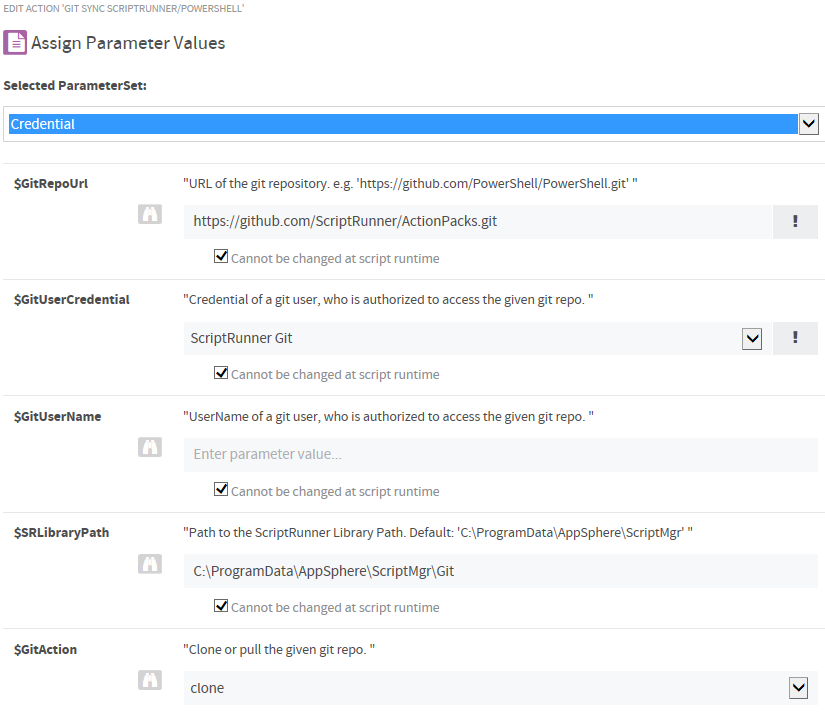

# Sync Git repositories to ScriptRunner

You can use the [Invoke-GitSync.ps1](./Invoke-GitSync.ps1) script to clone a Git repository to the ScriptRunner Library or pull updates to a local repository.

The script requires [Git for Windows](https://git-for-windows.github.io). You can download this tool from [GitHub](https://github.com/git-for-windows/git/releases).

## Script Parameters

- GitRepoUrl

    URL of the git repository. e.g. `https://github.com/ScriptRunner/ActionPacks.git`

- GitUserCredential

    Credential of a git user, who is authorized to access the given git repository. Note that an email address is not a valid account name. You must use this ParameterSet for private repositories.

- GitUserName

    UserName of a git user, who is authorized to access the given git repository. Note that an email address is not a valid account name. You can use this ParameterSet for public repositories.

- SRLibraryPath

    Path to the ScriptRunner Library Path.
    Default: `C:\ProgramData\AppSphere\ScriptMgr`

- GitAction

    `Clone` or `pull` the given git repository. Use `clone` for a initial download and `pull` to update already cloned repositories.

## How-To create a ScriptRunner Action

- Install `Git for Windows` at the ScriptRunner service host.
- Download the [Invoke-GitSync.ps1](./Invoke-GitSync.ps1) script to the ScriptRunner script repository. The default location of the ScriptRunner script repository is `C:\ProgramData\AppSphere\ScriptMgr`.
- Use the ScriptRunner Admin App to
  - create a Credential with UserName and Password for authenthication at the git server, if you want to clone a private git repository. If you want to clone a public repository, you can use the `UserName` ParameterSet.
  - create a new `Action` with the [Invoke-GitSync.ps1](./Invoke-GitSync.ps1) script.
  - select `Direct Service Execution` as target of the `Action`.
  - set the required script parameters to `Cannot be changed at script runtime` to enable scheduling for the `Action`.
  - example for the assignment of action parameters:

    

## Links
[ScriptRunner Action Packs](https://www.scriptrunner.com/action-packs)

[Git for Windows](https://git-for-windows.github.io)

[Git for Windows Releases](https://github.com/git-for-windows/git/releases)

[Git Credential Manager for Windows](https://github.com/Microsoft/Git-Credential-Manager-for-Windows)
