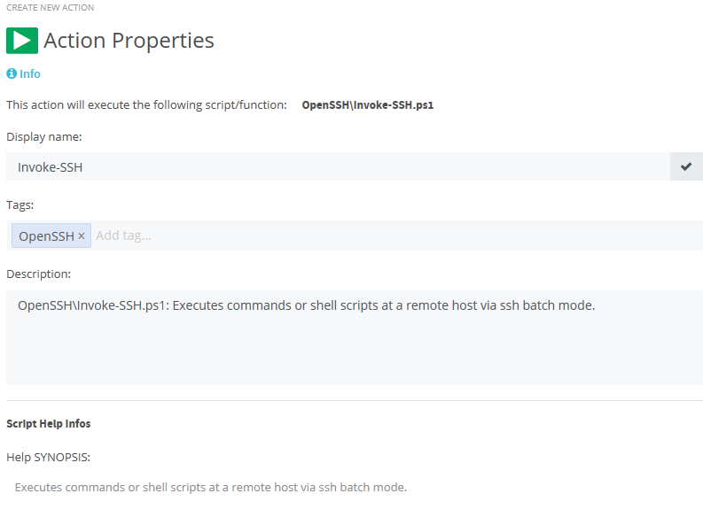

# OpenSSH

A brief introduction how you can run shell commands and shell scripts with ScriptRunner using OpenSSH.  

If not already done, you have to [install and config](./prepare.md) OpenSSH at your machines first.

When you are able to connect the target Linux host from your Windows host (e.g. the ScriptRunner Service Host) via SSH, you are ready to set up a ScriptRunner Action to run commands at the linux target from ScriptRunner.

1. Create a credential for the windows user, that should connect to the linux target.

    

2. Copy the [Invoke-SSH.ps1](./Invoke-SSH.ps1) script to the ScriptRunner Script Repository. This repository is located in `%ProgramData%\ScriptRunner\ScriptMgr`. It is recommended to copy the script into a subfolder like `OpenSSH`.

3. Create a ScriptRunner Action with the Invoke-SSH script. Use the target `PS Loopback Remoting`. Overwrite the target credentials with the previously created credential.

    

    

    

4. Set up the script parameters `UserName` and `RemoteHost` in the Action settings.

    

Now you should be able to run commands and scripts in the context of the user specified with the Parameter `UserName` at the `RemoteHost` from this ScriptRunner Action via SSH.
