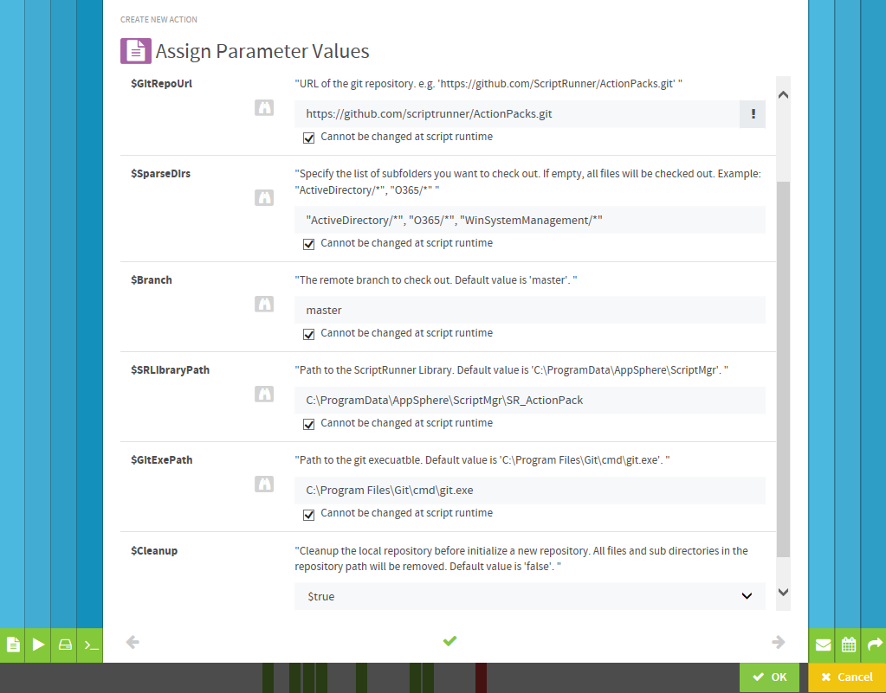

# Sync Git repositories to ScriptRunner

You can use the [Invoke-GitSparseCheckout.ps1](./Invoke-GitSparseCheckout.ps1) script to check out a branch of a Git repository to the ScriptRunner Library or pull updates to a local repository.

The script requires [Git for Windows](https://git-for-windows.github.io). You can download the tool set from [Git for Windows Releases at Github](https://github.com/git-for-windows/git/releases). In order to ensure that the script works without errors, you must also install the [Git Credential Manager](https://github.com/git-ecosystem/git-credential-manager#readme), which is shipped with **Git for Windows** installation.

## Script Parameters

- GitRepoUrl

    URL of the git repository. e.g.
  - `https://github.com/my-org/my-repo.git.git`
  - `https://gitlab.com/my-org/my-repo.git`
  - `https://bitbucket.org/my-org/my-repo.git`
  - `https://dev.azure.com/my-org/my-project/_git/my-repo`

- Branch

    The remote branch to check out.
    Default: `main`.

- SparseDirs

    Specify the list of subfolders you want to check out. If empty, all files will be checked out.
    Example: `"ActiveDirectory/*", "O365/*"`

- SRLibraryPath

    Check out the branch of the repository to this path at the ScriptRunner Library.
    Default: `C:\ProgramData\ScriptRunner\ScriptMgr\Git`

- GitExePath

    Path to the git execuatble.
    Default: `C:\Program Files\Git\cmd\git.exe`.

- Cleanup

    Cleanup the local repository path before initializing a new repository.
    All files and sub directories in the repository path will be removed before checking out the branch.

- AddRepositoryNameToPath

    Creates a folder with the repository name in the storage path, if not available.
    Otherwise, the system synchronizes directly to the storage path.
    Default value is 'true'

- RemoveGitConfig

    Deletes the hidden folder .git and .github from the storage path, after checking out the repo.
    This will also cleanup the local repository path before initializing a new repository.
    All files and sub directories in the repository path will be removed before checking out the repo.

- CheckSSL

    Do a SSL Check on git communication

- GitUserCredential

    Credential of a git user, who is authorized to access the given git repository.
    Note that an email address is not a valid account name. You must use this ParameterSet for private repositories.
    The username must not be empty and must match the AllowedUsernamePattern.
    You can use a personal access token (PAT) with BasicAuth headers as an alternative to username/password authentication in the url.
    Add the PAT as a password to the Credential and set the UseBasicAuth switch.

- AllowedUsernamePattern

    A regular expression to vaidate the username of the GitUserCredential.

- IgnoreUsername

    The username of the GitUserCredential will not be validated and will not be used for authentication but must not be empty.

- UseBasicAuth

    You can use a personal access token (PAT) with a BasicAuth header to authenticate as an alternate to user/password authentication in the URL.
    This parameter is intended for use with Azure DevOps Service or Azure DevOps Server, for example.
    Add the PAT as a password to the Credential and set this switch. Use the IgnoreUsername switch to skip the username of the GitUserCredential for authentication.

- UseSSH

    Uses ssh instead of https. Used for private repos and public key autentication.
    For use with a system account, the `known_hosts` and `id_rsa` file must be placed in `C:\Windows\System32\config\systemprofile\.ssh\`.
    Only the GitRepoUrl and SRLibraryPath parameter will be reflected when this swich is used.

## How-To create a ScriptRunner Action

- Install `Git for Windows` at the ScriptRunner service host.
- Download the [Invoke-GitSparseCheckout.ps1](./Invoke-GitSparseCheckout.ps1) script to the ScriptRunner script repository.
  The default location of the ScriptRunner script repository is`C:\ProgramData\ScriptRunner\ScriptMgr`.
- Use the ScriptRunner Admin App to
  - create a Credential with UserName and Password for authenthication at the git server, if you want to clone a private git repository. A credential is not required, if you want to clone a public repository.
- create a new `Action` with the [Invoke-GitSparseCheckout.ps1](./Invoke-GitSparseCheckout.ps1) script.
  - select the target `Direct Service Execution` in the new `Action` wizard.
  - set the required script parameters to `Cannot be changed at script runtime` to enable scheduling for the `Action`.
  - example for the assignment of action parameters:

    

## Links

[ScriptRunner Action Packs](https://www.scriptrunner.com/action-packs)

[Git for Windows](https://git-for-windows.github.io)

[Git for Windows at GitHub](https://github.com/git-for-windows/git#readme)

[Git for Windows Releases](https://github.com/git-for-windows/git/releases)

[Git Credential Manager](https://github.com/git-ecosystem/git-credential-manager#readme)

[Azure DevOps Services or Server - Use personal access tokens to authenticate](https://learn.microsoft.com/en-us/azure/devops/organizations/accounts/use-personal-access-tokens-to-authenticate)

[GitLab - Clone repository using personal access token](https://docs.gitlab.com/ee/user/profile/personal_access_tokens.html#clone-repository-using-personal-access-token)

[GitHub - Using a personal access token on the command line](https://docs.github.com/en/authentication/keeping-your-account-and-data-secure/managing-your-personal-access-tokens#using-a-personal-access-token-on-the-command-line)

[Bitbucket - Using Repository Access Tokens with the Git command line interface](https://support.atlassian.com/bitbucket-cloud/docs/using-access-tokens/)
