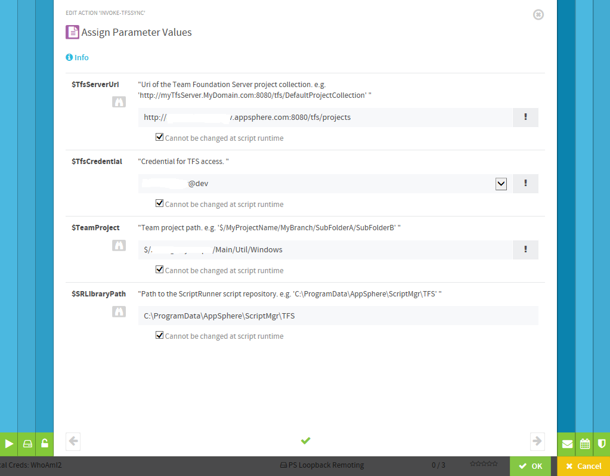

# Sync TFS projects to ScriptRunner

You can use the [Invoke-TfsSync.ps1](./Invoke-TfsSync.ps1) script to sync the latest version of a project folder from a Team Foundation Server project collection.
The script requires the TFS Power Tools. You can download the Tools from the [Visual Studio Marketplace](https://marketplace.visualstudio.com).

## Script Parameters

- TfsServerUri (Mandatory)

  The Uri of the Team Foundation Server project collection.  
  e.g. `http://myTfsServer.MyDomain.com:8080/tfs/DefaultProjectCollection`

- TfsCredential (Mandatory)

  The  Credential for TFS access.

- TeamProject (Mandatory)

  The Team project path.
  e.g. `$/MyProjectName/MyBranch/SubFolderA/SubFolderB`

- SRLibraryPath

  Path to the ScriptRunner script repository, where the local TFS workspace is created.  
  Default value: `C:\ProgramData\ScriptRunner\ScriptMgr\TFS`

- CleanSync

  Add this switch to cleanup your local workspace, before getting the latest version of your project folder.

## How-To create a ScriptRunner Action

- Install the TFS Power Tools at the ScriptRunner service host.
- Download the [Invoke-TfsSync.ps1](./Invoke-TfsSync.ps1) script to the ScriptRunner script repository.  
  The default location of the ScriptRunner script repository is `C:\ProgramData\ScriptRunner\ScriptMgr`.
- Use the ScriptRunner Admin App to
  - create a `Credential` with UserName and Password for authenthication at the Team Foundation Server.
  - create a new `Action` with the [Invoke-TfsSync.ps1](./Invoke-TfsSync.ps1) script.
  - select `Direct Service Execution` as target of the `Action`.
  - set the required script parameters to `Cannot be changed at script runtime` to enable scheduling for the `Action`.
  - example for the assignment of action parameters:

    

## Links

[TFS Power Tools for VisualStudio 2015](https://marketplace.visualstudio.com/items?itemName=TFSPowerToolsTeam.MicrosoftVisualStudioTeamFoundationServer2015Power)

[TFS Power Tools for VisualStudio 2013](https://marketplace.visualstudio.com/items?itemName=TFSPowerToolsTeam.MicrosoftVisualStudioTeamFoundationServer2013Power)

[ScriptRunner](https://scriptrunner.com "ScriptRunner")

## Notes

You need to match the version of the TFS Power Tools with your Visual Studio client. If you have VS 2015 installed, you need to install the TFS 2015 power tools. Regardless of which version of TFS you are targeting.